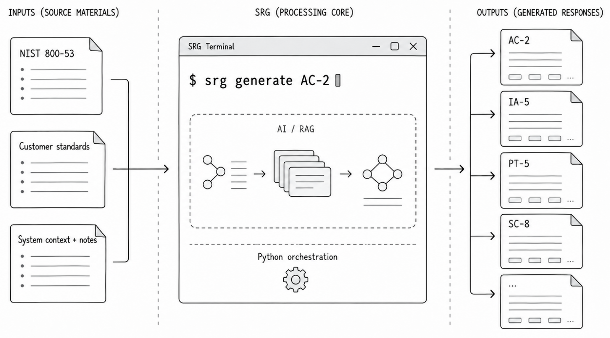
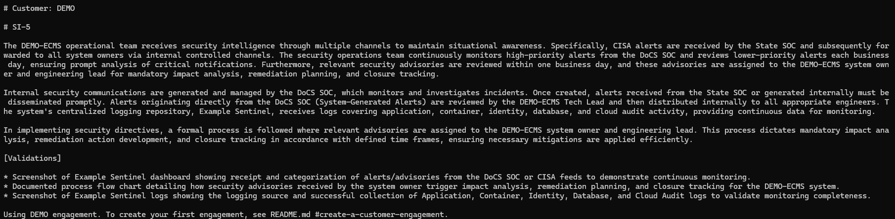
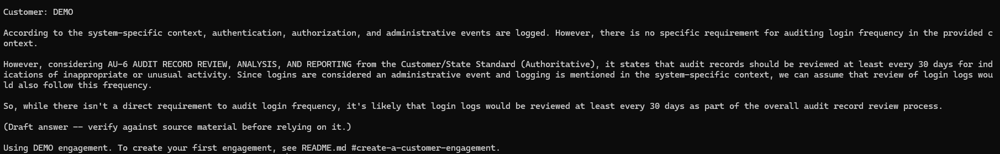

# Security Response Generator

[](https://github.com/buggycrash/security-response-generator/actions/workflows/ci.yml)
[](https://www.python.org/downloads/)
[](LICENSE)

## Why SRG?

SRG is built for a specific, common scenario: a small engineering team has no dedicated
security professional, but still needs to write clear, consistent prose explaining how
its system satisfies security controls. That work often falls to an existing
team member who understands the system but has little experience writing
control responses.



After an hour or two of initial setup, that team member with SRG can produce a draft
response in minutes. SRG maps the prose to the applicable NIST requirements *and* customer-specific parameters (password length, audit review frequency, etc.), using concrete system details supplied either in reusable private context files or with the individual request. The result is a faster drafting process with grounded requirement coverage. Additionally, SRG provides consistent tone and style over time regardless of which engineer requests the response generation, reducing cognitive load on both the writers, and the assessors.

---

Security Response Generator (`srg`) is a local CLI that drafts NIST SP
800-53 Release 5.2.0 control responses from:

- The included NIST SP 800-53 Release 5.2.0 catalog
- Customer-specific requirements, policy, and standards
- Private system context
- Any additional notes or context supplied with each request

## Prerequisites

- Customer approval to use local AI tooling for the engagement
- Python 3.11 or newer
- [Ollama](https://ollama.com/download)
- Enough local memory for the default generation, reviewer, and embedding
  models (Ollama may unload models between pipeline stages on constrained systems).  In practice, the default models need about 8GB of VRAM total.

## Supported platforms

SRG has been tested in Windows WSL2 Ubuntu 22.04 with 8GB of RAM and passthrough to 12GB VRAM, and on an Apple Silicon M1 MacBook
Pro with 16GB of unified memory running macOS Tahoe.  

Consider 8GB of dedicated VRAM or 16 GB of unified RAM as the minimum requirements   

It is not compatible with native
Windows.

## Security and privacy

SRG treats the workstation as its trust boundary, keeping customer material
and model processing local while isolating data between customer engagements;
see [Security & Privacy](docs/technical-readme.md#security--privacy) for the
conceptual data flow, safeguards, and boundary assumptions.

## Install

Clone the repository, enter its directory, and run:

```bash
./setup.sh
```

Setup creates the Python environment, installs `srg`, starts Ollama when
needed, downloads the default models, and installs the command launcher.

If setup reports that `~/.local/bin` is not on your `PATH`, follow the
one-time instruction it provides.

## Try the built-in demo

The initial engagement is `DEMO` (see below for what an engagement is). It includes:

- The project-level NIST SP 800-53 Release 5.2.0 catalog
- Fictional private context for `DEMO-ECMS`
- Fictional, and sometimes intentionally outrageous, customer-specific standards

Ingest the source material:

```bash
srg ingest
```

SI-5 is a typical security control assigned to nearly every system.  See https://csf.tools/reference/nist-sp-800-53/r5/si/si-5/ for the details, but basically all systems need to be aware of important security alerts.  

Generate an SI-5 response:

```bash
srg generate SI-5 --context "CISA alerts are received by the State SOC and forwarded to all system owners via internal controlled channels."
```



The response begins with `Customer: DEMO` to be clear this is for demonstration purposes.  
Response is not immediate, but takes less than 40 seconds on the tested platforms.


## Create a customer engagement

Supporting a real customer requires the creation of a customer engagement.  
Use a name that combines the governing state and system name:

```bash
srg create-engagement northbridge-SALI
```

The fictional State of Northbridge is used in this documentation to avoid misrepresentation or misattribution to any actual State.

The command activates the engagement and prints its document locations:

```text
Add customer standards files in:
  .../engagements/northbridge-sali/customer_standards

Add private system context details in:
  .../engagements/northbridge-sali/private_context
```

Copy the appropriate documents into those folders.  See the `example_files` folder
for some pointers of how to acquire standards documents for several States.

Then run:

```bash
srg ingest
srg generate SI-5 --context "Additional notes specific to this response."
```

The shared NIST catalog is not duplicated between engagements. Customer
standards, private context, indexes, and generated response folders remain
isolated under `engagements/<engagement-name>/`.

## Save a response

Markdown is the default output format, which gets printed to standard out where the user can copy/paste it elsewhere if appropriate.  Use `-o <path>/filename.md` to create persistent responses:

```bash
srg generate SI-5 -o <path>/SI-5-response.md
```

Plain-text is an alternate output format.  

```bash
srg generate SI-5 --format text -o <path>/SI-5-response.txt
```

Plain-text output retains normal capitalization while removing Markdown,
Unicode punctuation, and other non-ASCII characters that cannot be imported to 
some dedicated governance and compliance systems such as Xacta, Archer, ServiceNow CAM, or eMASS.

## Chat

Because the engineer may know their system, but not the security controls, SRG provides
the ability to ask about the controls, and if available, the customer standards.  

```bash
srg chat "How often do we need to audit logins?"
```


Chatting can be very useful when the user is still learning the customer standards, or the customer provides standards AND policy that both need to be considered when generating a response.

## Evaluate a candidate generation model

Run a short, repeatable comparison between an installed candidate model and
SRG's shipped generation model:

```bash
srg evaluate-model <candidate-model>
```

The command first shows the fictional test cases, model-call count, estimated
10-18 minute duration, and artifact location, then defaults to **no** at its
confirmation prompt. The current `smoke` profile is intended for development
feedback rather than final default-model qualification. See
[Evaluate a generation model](docs/technical-readme.md#evaluate-a-generation-model)
for its timing thresholds, quality checks, and output artifacts.

## Common next steps

```bash
srg --help
srg ingest --help
srg generate --help
srg chat --help
```

See [docs/technical-readme.md](docs/technical-readme.md) for:

- Model sizing and model selection
- Engagement management
- Incremental ingestion and rebuild behavior
- Retrieval and prompt architecture
- Environment variables
- Security and privacy details
- Improving output quality
- Troubleshooting
- Development and testing

## License

The original software and documentation are available under the
[MIT License](LICENSE). Third-party publications and separately downloaded
runtime components are governed by their own terms; see
[THIRD_PARTY_NOTICES.md](THIRD_PARTY_NOTICES.md).
