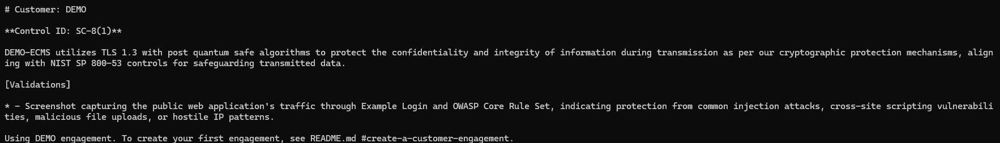

# Examples of SRG model use

Comparing the default model to a more capable model

All examples use the DEMO engagement

## Default model, AC-2

`srg generate AC-2 --context "There are no shared or group accounts."`

Note that the model produced a viable draft, but didn't quite understand how to incorporate the information provided by `--context`. This sort of omission or misunderstanding can be subtle. The response is still a pretty good draft, but requires more review and editing before passing to the assessor.

## Same prompt but with the Gemma4:E4B model

`SRG_GEN_MODEL=gemma4:e4b srg generate AC-2 --context "There are no shared or group accounts."`

With Gemma4:E4B, the context is understood and properly included in the response. This model and other more powerful models will provide better fidelity to the user's intent.

## Default model SC-8(1)

`srg generate "SC-8(1)" --context "They system uses TLS 1.3 with post quantum safe algorithms to protect the confidentiality and integrity of information during transmission."`

In this case, even the default model clearly understood and incorporated the `--context` information.

## Same prompt but with the Gemma4:E4B model

`SRG_GEN_MODEL=gemma4:e4b srg generate "SC-8(1)" --context "They system uses TLS 1.3 with post quantum safe algorithms to protect the confidentiality and integrity of information during transmission."`

The response in this case is not significantly better than the default model, since both properly incorporated the `--context` information.

## Phi4-mini is weak and inconsistent

`SRG_GEN_MODEL=phi4-mini srg generate "SC-8(1)" --context "They system uses TLS 1.3 with post quantum safe algorithms to protect the confidentiality and integrity of information during transmission."`

Totally improper output, and wrong context validations

Running the *exact same prompt* a second time

`SRG_GEN_MODEL=phi4-mini srg generate "SC-8(1)" --context "They system uses TLS 1.3 with post quantum safe algorithms to protect the confidentiality and integrity of information during transmission."`

This time it did produce a response that is somewhat aligned and did include the `--context` information, but with poorer prose overall and a misaligned validation statement.  

## Conclusion

Larger models are generally more reliable, but the default model will still produce a viable draft that significantly improves the speed of response generation compared to a fully manual process.  Smaller models like Phi4-mini are currently inappropriate due to their variablity of response quality and alignment.
