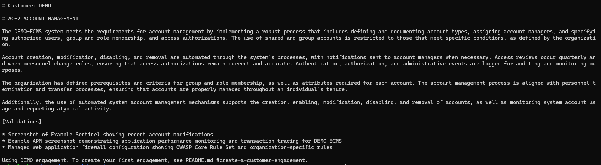
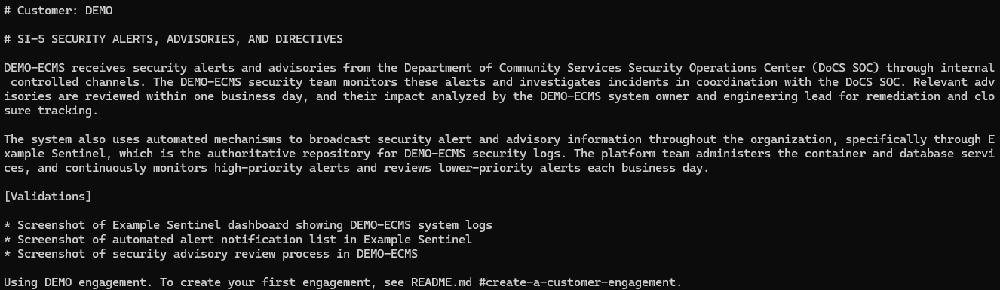
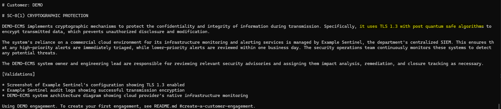
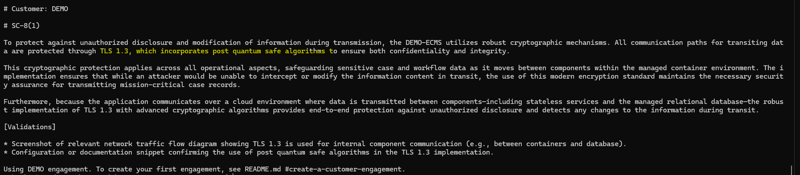
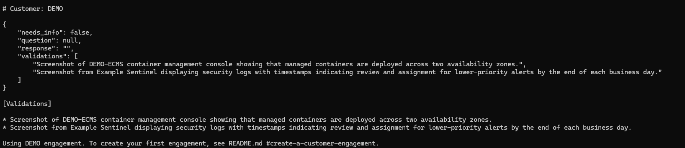

# Examples of SRG model use

Comparing the default model to other models  

All examples use the DEMO engagement

## Default model, Gemma4:E4B-it-qat, on SI-5

`srg generate SI-5 --context "CISA alerts are received by the State SOC and forwarded to all system owners via internal controlled channels."`

The model produced a viable draft, and included the input from the user along with the demo system context and tied those to the NIST control requirements.

## Same prompt but with a slightly less capable model

`SRG_GEN_MODEL=llama3.1:8b srg generate SI-5 --context "CISA alerts are received by the State SOC and forwarded to all system owners via internal controlled channels."`

Note that the model still produced a viable draft, but didn't quite understand how to incorporate the information provided by `--context`. This sort of omission or misunderstanding can be subtle sometimes, and requires the attention of the user. The response is still a pretty good draft, but requires more review and editing than the default model.

## Same prompt but with a similarly capable model that won't stay on topic

`SRG_GEN_MODEL=granite4.1:8b srg generate SI-5 --context "CISA alerts are received by the State SOC and forwarded to all system owners via internal controlled channels."`

The granite4.1:8B model from IBM is very accurate and thorough, literally tailor made for enterprise RAG scenarios, but tends to drift from the requested control as the highlighted areas show.  It occasionally will entirely shift the output style [see below].  This model also uses a bit more VRAM than an 8GB card can accomodate concurrently with the embeddingemma model.

Another example of granite4.1:8B, showing a wildly different output style and still drifting a little bit.  It flips between this style and prose unexpectedly, even if asked the same question.

## Smaller models are too weak and inconsistent

`SRG_GEN_MODEL=phi4-mini srg generate "SC-8(1)" --context "The system uses TLS 1.3 with post quantum safe algorithms to protect the confidentiality and integrity of information during transmission."`

This Phi4-mini model often output no response.  In testing, another very small model, Llama3.2:3B, was better at consistently generating *some sort of* output, but that output was often wrong, making false or contradictory claims.  The grantite4.1:**3b** model while generating different style output from Llama3.2:3B, still didn't generate anything close to a viable draft.

## Conclusion

Larger models are generally more reliable. The default `Gemma4:E4B-it-qat` model fits comfortably alongside the `embeddinggemma` model in much less than 8GB of VRAM and will reliably produce a viable draft.  Smaller models like `Phi4-mini` and `Llama3.2:3B` are currently inappropriate due to their variablity of response quality and alignment.  Several other models were tested and dismissed for various reasons.  All models tested are listed in the table below.

---
### Table of tested models
| **Model** | **Observations** |
| --- | --- |
| Phi4-mini (3.8B) | Inconsistent, sometimes no output |
| Llama3.2:3B | Poor alignment, sometimes wrong |
| Granite4.1:3B | Fair alignment but drifts to other controls, harsh prose |
| Qwen3.5:4B | Surprisingly good quality for a model this size, slow to output due to thinking, best sub 8B model tested by far, Chinese origin makes it unlikely to get customer approval for use. |
| Gemma3:4B | OK alignment but missed some details |
| Gemma4:E2B | OK alignment but still missed some details even though a newer generation, VRAM far larger than "2b" would suggest |
| Gemma4:E2B-it-qat | OK alignment, small VRAM footprint, chosen as the default reviewer model |
| Llama3.1:8B | Consistent, generally well aligned, a mostly viable alternative to the default model due to quality, consistency, and 7GB VRAM usage size |
| Granite4.1:8B | Thorough but drifts across control boundaries, sometimes harsh prose, needs 8GB of VRAM thus won't fit on an 8GB card alongside embeddinggemma and other system activity |
| Granite4.2:8B | Better than 4.1, but now slow (due to thinking) and still uses 8GB VRAM |
| Qwen3:8B | Good alignment, 5.2GB VRAM usage would fit well on an 8GB card, Chinese origin makes it unlikely to get customer approval for use. |
| Ornith-1.5:9b | Good quality and actual VRAM usage, but far too slow due to thinking. |
| Gemma4:E4B | Very good alignment and prose, but uses too much VRAM for even a 12GB card |
| Gemma4:E4B-it-qat | Essentially Gemma4:E4B with a smaller VRAM footprint.  Set as the default generation model. |
| Gemma4:12B-it-qat | Best prose of any model tested that would fit on the testing platform totally in VRAM, but does use 8GB of VRAM making it too large to fit on an 8GB card alongside embeddinggemma and other system activity.  Noticably slower than the default model. |
| Gemma4:26B-a4b-it-q4_K_M | MoE (mixture of experts) model that reliably produced viable drafts with smooth prose, but was far too large to fit typical consumer grade hardware. |

None of the tested 3B and 4B U.S.-based models produced output strong enough to recommend their use.  
The Qwen3.5:4B model did surprisingly well for the size but was slow.  Passing it some parameters to disable thinking and vision might have increased the speed.  

Of the U.S.-based models, The quantized (QAT) Gemma4 models provide the best all around quality in a small VRAM footprint.  Llama3.1:8B also proved capable and reliable, but used more VRAM while producing slightly lower quality.

The market is moving rapidly and there appears to be considerable effort from Google, Alibaba, and Meta to provide viable smaller open weight models, presumably due to the cost of RAM.  
