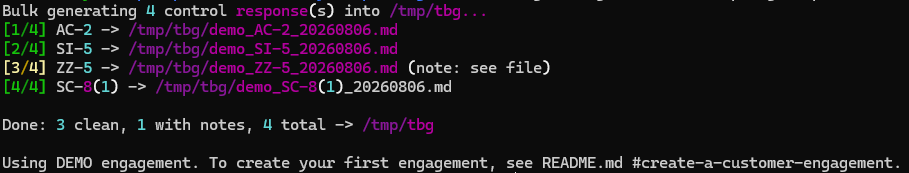

# Security Response Generator

A local-first CLI that drafts security control responses (for example,
NIST SP 800-53 controls such as `SI-5`) for a compliance assessor to review.
It uses retrieval-augmented generation (RAG) grounded in three tiers of
source material. Output can be Markdown or plain ASCII text, depending on
what the target system of record accepts:

1. **NIST SP 800-53 Rev. 5 baseline** — the control catalog around which SRG's
   ingestion and retrieval logic is designed. Supporting a different catalog,
   such as PCI DSS, HIPAA, or ISO/IEC 27001, would require code changes.
2. **Customer/state-specific standards** — for example, a state's published
   per-control guidance with state-specific parameter values. When present
   for a control, this is treated as **authoritative** over generic NIST
   language. Its content must use matching control catalog IDs.
3. **Private system context** — non-public specifics about the system being
   assessed, supplied through the active engagement's `private_context/`
   folder plus freeform context notes per query.

Everything runs locally: embeddings and generation both go through
[Ollama](https://ollama.com), and retrieval uses an embedded
[ChromaDB](https://www.trychroma.com) instance (a folder on disk, no server
process). SRG pins Ollama connections to the local loopback interface,
rejects cloud-tagged Ollama models before sending content, and disables
Chroma product telemetry.

Retrieval queries (both `generate`'s control/context text and `chat`'s
freeform question) are also expanded with a small, static NIST-vocabulary
synonym map (`generation/terminology.py`) before being embedded, so common
terms analysts use informally (e.g. "password") still surface content that
only uses the matching NIST umbrella term (e.g. "authenticator", IA-5). The
system prompts additionally include the same terminology mapping so the
generation model connects the two even when the wording differs.

## Features

- Three-tier retrieval that respects customer/state standards as
  authoritative when they exist. SRG itself (not the model) determines and
  states when no customer/state standard was found for a control.
- Runs on U.S.-developed, open-weight models (Gemma4:E4B-it-qat by default; see
  [Choosing a generation model](#choosing-a-generation-model)) rather than a
  closed-source or overseas API.
- Refuses to answer (rather than hallucinate) if a control ID has no match
  in the NIST baseline. SRG is a dedicated control-response tool, not a
  general chatbot.
- Interactive follow-up questions when a material part of the control isn't
  covered by the supplied context, up to a configurable round limit, with a
  best-effort placeholder-annotated response if the model still isn't done.
- Bulk, fully noninteractive generation from a CSV of control IDs and
  per-control context (`srg bulk-generate`), one output file per row, with
  control-specific problems noted inside that control's own file instead of
  asked as a question. See
  [Bulk-generate from a CSV](#bulk-generate-from-a-csv).
- Incremental ingestion — only re-embeds files that changed.
- Reproducible download and conversion of official NIST SP 800-53 OSCAL
  catalogs into chunker-compatible Markdown.
- Isolated customer engagements with a shared NIST SP 800-53 baseline, so
  switching customers never requires deleting or replacing another
  customer's files.
- Every generated response is labeled with its customer engagement (or
  `DEMO`) in code rather than relying on the model to identify it.
- Markdown or plain ASCII text output (`--format`), printed to stdout and
  optionally written to a file — plain text is enforced in code, not just by
  prompt instruction, for evidence/GRC systems that reject any formatting or
  non-ASCII characters.
- A separate validation section with suggested screenshots that an assessor
  could request to substantiate material claims in the draft.

## Caveats

- The ingest and retrieval processors remain tailored to NIST SP 800-53
  control IDs and heading structure. Use `srg update-nist` for official OSCAL
  updates; dropping in an arbitrary catalog or generic JSON-to-Markdown
  conversion may not preserve reliable control boundaries.

## Technology Stack

- **Language**: Python
- **Generation model**: [Gemma 4 E4B
  (QAT)](https://ollama.com/library/gemma4) via [Ollama](https://ollama.com)
  by default — the best output quality of any locally-viable option tested,
  in a quantized footprint that fits comfortably in 8 GB of VRAM alongside
  the embedding model. It is swappable through `SRG_GEN_MODEL`; see
  [Choosing a generation model](#choosing-a-generation-model) for tested
  models and results.
- **Reviewer model**: Gemma4 E2B QAT via Ollama by default, independently
  swappable through `SRG_REVIEW_MODEL`
- **Embedding model**: EmbeddingGemma via Ollama
- **Vector store**: ChromaDB (embedded/local, no server)
- **CLI**: [Typer](https://typer.tiangolo.com)

## Prerequisites

- Permission from your customer to use this tool. Different customers have
  very different AI usage policies.
- Python 3.11+
- [Ollama](https://ollama.com/download) installed, with the daemon running
- Ubuntu 22.04 is the only tested operating system. Native Windows is not
  supported; WSL2 is supported. macOS may be compatible but has not yet been
  tested.
- A modest amount of VRAM or unified memory for `gemma4:e4b-it-qat`
  (approximately 6.1 GB to download and under 4 GB of VRAM once loaded
  alongside `embeddinggemma`) — it fits comfortably on an 8 GB card. See
  [Choosing a generation model](#choosing-a-generation-model) for other
  tested options. SRG does not currently have a recommended generation
  model smaller than `gemma4:e4b-it-qat`.

## Installation

Clone the repository, then run the recommended setup script:

```bash
cd security-response-generator
./setup.sh
```

This creates a `.venv`, installs the package, starts Ollama when needed,
pulls the generation, reviewer, and embedding models (`gemma4:e4b-it-qat`,
`gemma4:e2b-it-qat`, and `embeddinggemma`), and installs a
small launcher at `~/.local/bin/srg`. The launcher invokes the project
virtual environment directly, so it does not need to be activated.

A built-in `demo` engagement is active initially. It uses the included
NIST SP 800-53 Release 5.2.0 catalog, fictional private system context, and
no customer-specific standards.

If `~/.local/bin` is not already on your `PATH`, setup prints the exact
one-time shell-profile change to add it. Check or troubleshoot the
installation at any time without changing anything:

```bash
./setup.sh --check
```

Other setup options include `--dev`, `--dev-only`, `--skip-models`,
`--model MODEL`, and `--install-dir DIR`; run `./setup.sh --help` for
details. `--dev-only` prepares the test environment and Git hook without
touching the command launcher, Ollama, or models.

## Cleanup

Run `./cleanup.sh` to remove the launcher owned by the current checkout and
the configured generation and embedding models. Because Ollama models are
shared and setup does not record whether a model predated SRG, review the
preview carefully or pass `--keep-models`. Cleanup does not uninstall Ollama,
stop its daemon, remove the project virtual environment, or delete the shared
NIST index.

Setup never edits shell profiles. Cleanup therefore prints the exact `PATH`
line to remove manually rather than modifying a profile it does not own.

Engagement data is retained unless `--wipe-engagements` is supplied. That
option requires both the explicit flag and a second exact typed confirmation;
it deletes customer engagements, local active-engagement state, and generated
demo data while preserving the committed fictional demo seed files.

## Choosing a generation model

> [!WARNING]
> Model weights are not included in this source repository and are not
> covered by its MIT License. Running `./setup.sh` without `--skip-models`
> downloads them into Ollama's local model storage, where they become
> separately licensed runtime components of the installed project. The
> default generation and reviewer models are governed by the
> [Apache License 2.0](https://www.apache.org/licenses/LICENSE-2.0); the
> default embedding model is governed by the
> [Gemma Terms of Use](https://ai.google.dev/gemma/terms). See
> [THIRD_PARTY_NOTICES.md](../THIRD_PARTY_NOTICES.md).

The default, `gemma4:e4b-it-qat`, was selected after direct comparisons on
SRG's retrieval and generation workload against every other model in the
table below — it produced the best output quality and alignment of any
locally-viable option tested, in a quantized footprint that fits comfortably
alongside `embeddinggemma`. It remains a compromise, though: on complex
controls it can still omit or misunderstand relevant context even when
retrieval supplied the correct material. Every generated response is
therefore a draft requiring human review.

See [Examples of SRG model use](Examples-of-SRG-use.md) for the aforementioned table and side-by-side
outputs from the default model and considered alternatives using identical
prompts.

`gemma4:e4b-it-qat` is a quantization-aware-trained (QAT) build of Google's
Gemma 4 E4B, part of a multimodal model family that still carries unused
vision/audio encoders this tool never exercises. QAT quantization is what
brings its resident footprint down to well under 7 GB, letting it coexist
with `embeddinggemma` on an 8 GB card without the evict-and-reload cycling
that tighter-fitting models can trigger on every `srg generate` call. See
"Responses are much slower than expected" in
[Troubleshooting](#troubleshooting) for symptoms and mitigations.

**[Phi-4-mini](https://ollama.com/library/phi4-mini)** (Microsoft) was tested
because its approximately 3.8B parameters and 2.5 GB download make it
attractive for constrained hardware. It is not sufficient for SRG's
generation workload and should not be used for control responses. Across
repeated identical prompts, it produced inconsistent output, omitted explicit
analyst context, drifted from the requested control, and generated validation
suggestions unrelated to its claims. Those are model-capability failures, not
retrieval failures. `gemma4:e4b-it-qat` is the minimum recommended local
generation model; if your hardware cannot run it, SRG does not currently
offer a suitable smaller fallback.

The plain **[Gemma 4 E4B](https://ollama.com/library/gemma4)** (non-QAT) tag
was also tested and produced very good alignment and prose — but at roughly
9.6 GB, its footprint sits at the edge of what's available on a 12 GB card
alongside `embeddinggemma`, making it prone to VRAM-eviction cycling in
testing. The QAT build now used as the default achieves essentially the same
quality for meaningfully less VRAM, so the plain tag isn't recommended over
it; it's only worth considering if you have significantly more VRAM
available (roughly 16 GB or more) and want to rule out any possible
QAT-related quality difference yourself.

Switch models with the `SRG_GEN_MODEL` environment variable — no code
changes needed, since `srg` talks to Ollama's generic chat API regardless
of which model is behind it:

```bash
ollama pull llama3.1:8b
SRG_GEN_MODEL=llama3.1:8b srg generate SI-5 --context "..."
```

To make a switch permanent for your own sessions, export `SRG_GEN_MODEL` in
your shell profile.

When review is active, the pipeline uses `gemma4:e2b-it-qat` by default,
matching the generation model's family. Review is automatic for
`bulk-generate` and opt-in with `srg generate --review`. Override the
reviewer model independently:

```bash
ollama pull llama3.1:8b
SRG_REVIEW_MODEL=llama3.1:8b srg generate SI-5 --context "..."
```

Local open-weight model quality is a fast-moving target — new and improved
releases show up often enough that today's defaults shouldn't be treated as
permanent. It's worth periodically re-testing both the generation and
reviewer model choices against your own prompts and hardware as new models
become available.

After each generation request, SRG asks Ollama to keep the generation model
loaded for 20 minutes to make subsequent runs faster. `embeddinggemma` is
kept loaded for that same duration by default, since it's invoked on every
`generate` and `chat` call for retrieval and has its own non-trivial load
time. The reviewer uses the same duration by default. Override durations
independently with `SRG_GEN_KEEP_ALIVE`, `SRG_REVIEW_KEEP_ALIVE`, and
`SRG_EMBED_KEEP_ALIVE`, using an Ollama duration such as `30m` or `1h`:

```bash
SRG_GEN_KEEP_ALIVE=30m srg generate SI-5
SRG_REVIEW_KEEP_ALIVE=30m srg generate SI-5
SRG_EMBED_KEEP_ALIVE=30m srg generate SI-5
```

Generation requests use a fixed `seed` of `42` by default for reproducible
output across runs; override it with `SRG_GEN_SEED` if you want varied
output. `temperature` is left unset by default, so the generation model's
own Modelfile default applies, or Ollama's if the model does not provide. Some models show wild output variance at non-default
temperatures, so this stays opt-in via `SRG_GEN_TEMPERATURE` rather than
being forced. Note that seed alone doesn't guarantee identical output
run-to-run, since floating-point variance in the model runner can still
shift results:

```bash
SRG_GEN_TEMPERATURE=0 SRG_GEN_SEED=7 srg generate SI-5
```

The interactive follow-up-question feature (see
[Interactive follow-up questions](#interactive-follow-up-questions)) is
enforced via Ollama's structured-output/JSON-schema support rather than a
free-form response protocol. This keeps reply parsing consistent across
models, although the accuracy and completeness of the generated content
still depend on the selected model.

The embedding model (`embeddinggemma`) is a separate, much smaller model
used only for retrieval, and typically doesn't need to change when you swap
the generation model.

### Using a customer-approved cloud gateway (for example, AWS Bedrock)

Everything above assumes local models because most engagements haven't
pre-approved sending customer or system data to any external service (see
[Prerequisites](#prerequisites) and
[Security & Privacy](#security--privacy)). That default flips for a specific,
common situation: a customer that already provides AWS Bedrock as their own
sanctioned interface to a set of approved models. In that case, routing
generation through the customer's Bedrock endpoint isn't sending data to an
arbitrary third party — it stays inside a boundary the customer has already
vetted, under whatever data-handling terms they negotiated with AWS. If
that's your situation, it can be a reasonable choice, and often a better
one: Bedrock exposes larger, frontier-class models than what's practical to
run locally on constrained hardware, which can mean meaningfully more
nuanced, better-grounded responses than the supported local options above.

A few things worth confirming before doing this on any given engagement:

- Get it in writing the same way you would any other AI usage on the
  engagement — Bedrock accounts and configurations vary (region, logging/
  retention via CloudTrail, cross-region inference, per-model-provider data
  terms), and "the customer approved Bedrock" doesn't automatically cover
  every model or setting available through it.
- Retrieval and embedding (`embeddinggemma`) would stay local exactly as
  today — this only changes where the assembled prompt for the
  *generation* step gets sent, the same distinction as choosing between
  local models above.

This isn't implemented today — `llm/ollama_client.py`'s `chat_messages()`
is currently the only function that talks to a generation model, and it
assumes Ollama's chat API. Adding Bedrock support would mean a parallel
client (for example, via `boto3`'s `bedrock-runtime` Converse API) behind a
provider switch, plus reimplementing the JSON-schema structured-output
contract used for the
[interactive follow-up mechanism](#interactive-follow-up-questions) against
Bedrock's equivalent. It's noted here as a legitimate option worth knowing
about, not a decision this tool makes for you.

## Usage

The setup script installs an `srg` launcher in `~/.local/bin`; no virtual
environment activation or per-session startup command is required. If that
directory is not already on your `PATH`, setup shows the one-time change
needed to add it. The launcher starts the local Ollama daemon automatically
when necessary and then runs the command from this project's virtual
environment. This means `srg` works from any directory after setup.

1. **Add source material**:
   - The supported NIST SP 800-53 Release 5.2.0 catalog is already included in
     `knowledge_base/`. This project intentionally does not support switching
     to ISO, PCI DSS, or another control catalog.
   - On a fresh installation, the active `demo` engagement already contains
     fictional private context and no customer standards.
   - For real work, create an engagement first:
     ```bash
     srg create-engagement <governing-state>-<system-name>

     # For example:
     srg create-engagement northbridge-SALI
     ```
     The command prints the engagement-specific folders where customer
     standards and private system context belong.
     Use `--customer-name "State of Northbridge"` when the response label
     should be more formal than the title-cased folder name.

2. **Update the NIST catalog when needed**:
   ```bash
   srg update-nist
   ```
   By default, this downloads the official NIST OSCAL JSON catalog from the
   fixed `oscal-content` release tag `v1.4.0`, which contains SP 800-53
   Release 5.2.0. The source is intentionally pinned rather than resolved as
   "latest" so the same SRG version does not silently begin ingesting
   different regulatory content and so the generated baseline remains
   reproducible. The command validates the catalog metadata and atomically
   regenerates `knowledge_base/NIST.SP.800-53-oscal.md`. It records the source
   URL, catalog version, last-modified value, and source SHA-256 digest in
   the output. The converter emits headings compatible with exact control
   retrieval, resolves OSCAL organization-defined parameter references into
   readable placeholders, and includes SP 800-53 statements and guidance.
   SP 800-53A assessment objectives and methods bundled in the source OSCAL
   catalog are intentionally excluded.

   Updating to a future official release is therefore an explicit action:
   pass its HTTPS URL or a downloaded local copy with `--source`.
   `--output` selects a different Markdown destination. The command does not
   require Ollama and does not ingest or embed the result automatically.

3. **Ingest**:

   ```bash
   srg ingest
   ```

   The initial run may take several minutes. Re-run this command whenever
   files in the source folders change — unchanged files are
   skipped automatically. Use `--source knowledge_base|customer_standards|private_context`
   to ingest just one tier. `--rebuild` rebuilds only the active
   engagement's customer/private index. The shared NIST baseline requires
   the deliberately explicit `--rebuild-baseline` option.
   Large files show a progress bar on stderr as embedding batches complete,
   so a long ingest does not look stalled.

4. **Generate a response**:

   ```bash
   srg generate SI-5 --context "our environment uses a SaaS SIEM for continuous monitoring"
   ```

   Control enhancements work the same way. Quote an enhancement ID so the
   shell passes its parentheses to SRG instead of interpreting them as shell
   syntax:

   ```bash
   srg generate "SC-8(1)" --context "TLS 1.3 protects information in transit."
   ```

   Retrieval, analyst context, follow-up questions, validation suggestions,
   formatting, and file output behave the same way for controls and control
   enhancements.

   The first request may take longer while Ollama loads the model. SRG prints
   Markdown to stdout by default. Add `-o response.md` to also write
   it to a file (or to a directory, in which case a customer-labeled filename
   like `northbridge_SI-5_20260715.md` is generated). Every response begins
   with `Customer: Northbridge` (or `Customer: DEMO`) and ends with a
   `[Validations]` section containing suggested screenshot evidence.
   A spinner appears on stderr while waiting for the model, leaving stdout
   clean for piping and redirection.

   For evidence/GRC systems that only accept raw text with no formatting,
   such as some Archer or Xacta configurations, add `--format text`:

   ```bash
   srg generate SI-5 --format text --context "..." -o response.txt
   ```

   This produces plain ASCII output — no Markdown syntax, no smart quotes,
   em dashes, bullets, or other non-ASCII characters.
   A directory target with `--format text` gets a `.txt` filename instead
   of `.md`.

### Interactive follow-up questions

If the model determines that a distinct, material part of the control
isn't covered by the retrieved material, your `--context` notes, or anything
already discussed, it can ask you a clarifying question instead of guessing:

```
$ srg generate SI-5 --context "we use Acme Sentinel for monitoring"

What is the required review/dissemination timeframe for security alerts in
your environment?

Your answer: reviewed within 24 hours, disseminated within 48 hours
```

Answer at the prompt to continue the same conversation; there is no need to
rerun the command. This can happen up to `SRG_MAX_FOLLOWUP_TURNS` times
(default **2**). If it still isn't done after that, one final call produces
a best-effort response anyway: it opens with a brief note that some
information wasn't available, and inserts `[PLACEHOLDER: ...]` markers in
place of anything it couldn't address confidently, so you can fill those in
by hand before submitting to the assessor.

The tool is designed to produce a bounded, best-effort draft rather than
questioning indefinitely.

## Bulk-generate from a CSV

`srg bulk-generate` drafts responses for many controls in one unattended run.
It never asks a follow-up question and never blocks on input — a control that
would have needed one gets a best-effort response instead, exactly like
`srg generate` after its follow-up budget runs out (see
[Interactive follow-up questions](#interactive-follow-up-questions)).
Every bulk response automatically receives two reviewer critiques and two
generator revisions. Bulk generation has no human in the loop, and its
unattended throughput makes the added time to completion less important than the extra quality check.

```bash
srg bulk-generate -o engagements/northbridge-SALI/responses controls.csv 
```

The CSV needs exactly two columns, matched case- and whitespace-insensitively
(extra columns are ignored):

```csv
Control ID,User added context
AC-2,Uses Okta for account provisioning and deprovisioning.
SI-5,we use Acme Sentinel for monitoring
SC-8(1),TLS 1.3 protects information in transit.
```



**Upfront file validation** (checked before touching Ollama, Chroma, or the
active engagement at all, and reported together rather than one at a time):
missing either required column, no data rows, more rows than
`SRG_MAX_BULK_CONTROLS` (default **25** — enough to cover an entire control
family other than SC), a malformed control ID, an empty Control ID cell, or a
duplicate control ID.

**Per-control problems vs. run-wide failures** are handled differently:

- A problem specific to one control — its ID has no match in the ingested
  NIST baseline, or the model would have asked a clarifying question — is
  written into *that control's own output file* as a note, and the run
  continues with the next row.
- A problem that would affect every remaining row identically — Ollama is
  unreachable, the configured model is invalid, the knowledge base hasn't
  been ingested, or a file can't be written to the output directory — aborts
  the whole run immediately. Files already written for earlier rows are left
  in place, and the tool reports which controls completed and which weren't
  attempted.

Each successful row is written to `<output-dir>/<engagement-slug>_<control
ID>_<date>.<ext>`, the same naming convention `srg generate -o` uses for a
directory target. Re-running the same CSV against the same output directory
on the same day overwrites that control's prior file, matching
`srg generate -o`'s existing behavior. `--format text` and the
`SRG_MAX_BULK_CONTROLS` override work the same way they do for `generate`.

## Improving output quality

Output quality depends first on the facts available to the model and then on
the model's ability to interpret them. A larger model cannot reliably fill in
missing system information, so improve grounding before treating model size as
a substitute for context. In practical order:

1. **Add useful, reusable system information to `private_context/`.** Include
   stable details that may support many controls: system architecture,
   authentication and authorization mechanisms, administrative roles,
   logging and monitoring practices, account and change-management processes,
   review frequencies, and named tools. Keep the material specific enough to
   support concrete claims and free of unsupported assumptions. After adding
   or changing files, update the active engagement's index:

   ```bash
   srg ingest --source private_context
   ```

2. **Supply control-specific facts with `--context`.** Use this for details
   that are especially relevant to the response being drafted, including
   implementation choices, exact parameter values, applicability conditions,
   exceptions, and facts that may not belong in a reusable system document.
   Be explicit rather than relying on the model to infer the consequence. For
   example:

   ```bash
   srg generate "AC-2" --context "Shared and group accounts are prohibited and are not deployed."
   ```

   `--context` applies immediately to that generation request and does not
   require re-ingestion. If the same fact should inform many controls, put it
   in `private_context/` instead of repeating it on every command.

3. **Use a more capable generation model when hardware permits.** Better
   grounding still requires a model capable of following nuanced context and
   synthesizing a complex control. Gemma 4 E4B was more reliable than the
   default model on some identical prompts. See
   [Choosing a generation model](#choosing-a-generation-model) and the
   [side-by-side model outputs](Examples-of-SRG-use.md) for the observed
   differences.

These measures are complementary. Start with accurate source material, add
the facts unique to the current control, and then use the strongest supported
model your hardware can run. More capable generation improves interpretation;
it does not remove the need for grounded inputs or human review of the draft.

## Customer engagements

Customer documents and indexes are isolated under `engagements/<state name>-<system name>/`.
The NIST baseline remains shared and is not duplicated for each customer.

```bash
srg create-engagement northbridge-SALI  # creates and activates it
srg show-engagement                     # shows active folders
srg list-engagements
srg use-engagement demo
srg use-engagement northbridge-SALI
```

Creating an engagement makes empty `customer_standards/`, `private_context/`,
`chroma_db/`, and `responses/` folders. Copy the applicable starter files
from `example_files/` into the paths printed by `create-engagement`, add
private context, and run `srg ingest`. Switching engagements changes which
customer/private index is queried; it does not delete or modify either
customer's files.

If DEMO is active after you have already created an engagement, run
`srg list-engagements` and then `srg use-engagement <engagement-name>` to
select it.

## Development

```bash
./setup.sh --dev-only            # install dev dependencies and enable Git hooks
.venv/bin/pytest               # run tests
.venv/bin/ruff check .          # lint
.venv/bin/ruff format --check . # verify formatting
```

See [CONTRIBUTING.md](../CONTRIBUTING.md) for the complete contribution
workflow. GitHub Actions runs the same lint, formatting, and test checks on
pull requests and pushes to `main`.

Most of the pipeline (chunking, manifest diffing, prompt assembly, retrieval
merge logic, CLI argument parsing) is unit-tested without needing a live
Ollama instance. Actual embedding/retrieval quality and generation output
require a live Ollama daemon with both models pulled and are verified
manually — see the "Manual verification" section below.

## How It Works

1. **Prepare the NIST baseline**: `srg update-nist` downloads or reads an
   OSCAL JSON catalog and converts only its SP 800-53 control material into
   deterministic, ingest-ready Markdown. This optional update operation is
   separate from ingest and is the only networked NIST step.
2. **Ingest**: documents are loaded (`.pdf` via `pypdf`, `.md`/`.txt`
   directly), split into ~800-token chunks with overlap (splitting on
   headers/paragraphs where possible), tagged with any control IDs found
   in the text, embedded via EmbeddingGemma, and stored in one of three
   Chroma collections. The `knowledge_base` collection is shared, while
   `customer_standards` and `private_context` live in the active
   engagement's isolated database. Separate manifests make re-ingestion
   incremental.
3. **Retrieve**: for a given control ID and freeform notes, each collection
   is queried twice — once filtered to chunks whose text contains the
   control ID, once by semantic similarity — and the results are merged,
   with `customer_standards` and `private_context` given protected
   top-k slots so they aren't drowned out by the much larger NIST corpus.
4. **Refuse or caveat**: if the NIST baseline has no exact match for the control
   ID, the tool refuses and exits non-zero rather than guessing. The same
   exact-match check (not mere semantic proximity) determines whether a genuine
   customer/state standard match exists: if the baseline matches but no
   customer/state standard does, generation proceeds and SRG itself prepends an
   explicit note to that effect after generation completes -- this determination
   is made from the retrieval result in code, not left to the model, since a
   small local model self-reporting this proved unreliable in both directions
   (silently omitting the caveat, and occasionally claiming no standard existed
   when one actually did).
5. **Generate**: retrieved chunks (labeled by tier), the control ID, and
   the analyst's notes are assembled into a prompt alongside
   `prompts/instructions.md` (editable — controls tone, implementation
   structure, validation guidance, and the authoritative-standards rule) and
   a format-specific rendering instruction (Markdown vs. plain ASCII text,
   chosen via `--format`).
   Analyst-provided `--context` facts are placed in the system message so
   they receive the same priority as the editable instructions. The assembled
   messages are then sent through Ollama to the generation model
   (`gemma4:e4b-it-qat` by default; see
   [Choosing a generation model](#choosing-a-generation-model)).
   `instructions.md` is read fresh for every `srg generate` invocation, so
   edits apply immediately without re-ingesting documents or restarting SRG.
   The format-specific instruction only controls character-level rendering;
   it preserves sections and other response structure requested by the
   editable system instructions.
   The model returns a JSON-schema-constrained reply (`needs_info`,
   `question`, `response`, and `validations`) rather than free-form text, so
   the follow-up mechanism can reliably distinguish a question from a final
   response. SRG renders structured validation suggestions after the
   implementation prose and removes any duplicate validation section the
   model may have included in the prose. If the model returns no suggestions,
   SRG emits a visible placeholder instead of silently omitting the section.
6. **Follow up if needed**: if the reply has `needs_info: true`, its
   `question` is shown to you interactively and your typed answer is
   appended to the conversation before calling the model again — up to
   `SRG_MAX_FOLLOWUP_TURNS` times (default 2). If the budget runs out, one
   final call forces a best-effort response with `[PLACEHOLDER: ...]`
   markers for anything still unaddressed.
7. **Review and revise when enabled**: `bulk-generate` always runs two review
   passes; interactive `srg generate` runs them only with `--review`. Once a
   complete draft exists, the separate local reviewer checks it against the
   original instructions, grounding material, and analyst facts. Its critique
   goes to the generator for a complete revision, then SRG repeats that cycle
   once. These stages do not prompt the human; missing facts remain explicit
   placeholders.

   Review is opt-in for interactive generation because the analyst is already
   the reviewer: they can inspect the draft and rerun or re-prompt with better
   facts and clarifications. Skipping four additional model calls also avoids
   a significant wait in an intentionally interactive workflow. Bulk generation
   makes the opposite tradeoff: there is no human reviewer during the run, and
   time to completion is less important for unattended work, so review remains mandatory.
8. **Normalize (text format only)**: if `--format text` was requested, the
   raw model output is run through `generation/formatting.py`, which
   converts smart quotes/em-dashes/bullets to ASCII equivalents, strips any
   leftover Markdown syntax, and drops any remaining non-ASCII characters —
   a code-level guarantee independent of how well the model followed the
   prompt instruction.
9. **Output**: the response is printed to stdout and optionally written to
   a file.

### Why RAG instead of long-context stuffing

An alternative architecture was considered: skip chunking/embedding/retrieval
entirely and paste the full NIST catalog plus the engagement's complete
customer-standards and private-context documents into every prompt. The math
ruled it out.

- The NIST SP 800-53 catalog (`knowledge_base/NIST.SP.800-53-oscal.md`) is
  about 1.3 MB / 170,000 words — roughly 250,000–330,000 tokens using this
  project's own chars-per-token convention (see the `NUM_CTX` comment in
  `config.py`). That's already 2x larger than the default model's published
  128,000-token context window on its own — it doesn't fit in a single
  request, regardless of hardware.
- Real customer-standards bodies aren't small either. The example/demo
  fixtures in this repo are only a few thousand tokens, but a full
  per-jurisdiction standards body for a real engagement can be substantially
  larger, often larger than the NIST catalog itself.
- Even a model that could accept that much context would need the VRAM for
  it: the default model's KV cache runs about 128 KiB per token of context
  (consistent with this project's documented ~7 GB VRAM footprint at the
  current `NUM_CTX=16384`). Holding a few hundred thousand tokens of context
  would need tens of GB of VRAM for KV cache alone, on top of model weights,
  plus minutes of added prompt-processing latency per request.
- Bigger context isn't free from an accuracy standpoint either: burying the
  one relevant control's few-hundred-token section inside hundreds of
  thousands of mostly irrelevant tokens is the "lost in the middle" failure
  mode smaller dense models are particularly prone to — it would likely make
  responses worse, not better.

Retrieval keeps each request small (a bounded top-k slice per tier, sized in
`config.py`) precisely because both source corpora — the shared NIST
baseline, and for larger jurisdictions the customer-standards material
itself — can each individually exceed what any locally-run model's context
window can hold.

## File Structure

```
security-response-generator/
├── pyproject.toml
├── setup.sh
├── srg                              # PATH-installed runtime launcher
├── scripts/common.sh                # shared setup/runtime health checks
├── prompts/instructions.md          # editable system prompt
├── knowledge_base/                  # committed: NIST SP 800-53 Rev. 5 catalog
├── chroma_db/                       # shared NIST embeddings
├── engagements/
│   ├── demo/                        # committed fictional demo context
│   └── <customer>/                  # gitignored customer data
│       ├── customer_standards/
│       ├── private_context/
│       ├── chroma_db/
│       └── responses/
├── example_files/                   # committed: per-jurisdiction starter material
│   └── Federal/ VA/ PA/ CA/ MD/ HI/ # copy into an engagement as applicable
├── docs/                            # technical guide, examples, and images
├── src/security_response_generator/
│   ├── cli.py                       # update, ingest, engagement, generation, and bulk-generate commands
│   ├── config.py                    # models, paths, chunking, top-k (env-overridable)
│   ├── ingest/                      # loaders, chunking, manifest, Chroma store
│   ├── generation/                  # retrieval, prompt assembly, ASCII normalizer
│   └── llm/ollama_client.py         # Ollama embed/chat wrapper
└── tests/
```

## Troubleshooting

- **`ollama: command not found`**: install it from the
  [Ollama download page](https://ollama.com/download).
- **Ollama daemon not running**: the `srg` launcher normally starts it
  automatically. If startup fails, review `/tmp/srg-ollama-serve.log` (or
  `$TMPDIR/srg-ollama-serve.log` when `TMPDIR` is set).
- **Installation seems incomplete**: run `./setup.sh --check` for individual
  Python, launcher, Ollama, and model health checks.
- **`srg generate` refuses every control ID**: run `srg ingest` first — the
  NIST baseline collection is empty until `knowledge_base/` is ingested.
- **`srg bulk-generate` rejects the CSV outright**: it prints every problem it
  found (wrong/missing column headers, too many rows, a duplicate or
  malformed control ID) before generating anything — see
  [Bulk-generate from a CSV](#bulk-generate-from-a-csv) for the exact
  validation rules.
- **Model pull is slow/fails**: check disk space and network
  connectivity.  Ollama parallelizes model pulls, which quickly runs afoul of default network settings in WSL2 and Windows.
- **Responses are much slower than expected**: run `ollama ps` to check
  whether the model is fully on GPU or partially spilled to system RAM/CPU
  (Ollama does this automatically and silently if VRAM is tight, and it's a
  common source of unexplained slowness). Lowering context length or closing
  other GPU-heavy applications usually resolves it.
- **`srg ingest` fails with `ResponseError: ... EOF` on a large document**
  (for example, the full NIST SP 800-53 catalog): this is the
  embedding model's runner subprocess getting OOM-killed — check Ollama's
  own log (`journalctl -u ollama`, or the terminal running `ollama serve`
  if you started it manually) for a `signal: killed` line to confirm.
  `srg ingest` already batches embedding requests (`SRG_EMBED_BATCH_SIZE`,
  default 32) to avoid this; if it still happens on a memory-constrained
  machine (for example, WSL2 with a low `.wslconfig` memory cap), try lowering the
  batch size further:
  ```bash
  SRG_EMBED_BATCH_SIZE=8 srg ingest
  ```

## Security & Privacy

- Customer engagement folders are gitignored, including their standards,
  private context, indexes, and generated responses. Only the explicitly
  fictional `engagements/demo/` seed files are committed.
- The Python client is pinned to Ollama at `127.0.0.1:11434`; an
  `OLLAMA_HOST` environment override cannot redirect SRG to a remote server.
- SRG rejects Ollama model tags ending in `cloud` or `-cloud` before sending
  document or prompt content.
- Every Ollama CLI call made by the setup script or launcher is pinned to
  loopback. Any Ollama daemon started by SRG has cloud features disabled
  with `OLLAMA_NO_CLOUD=1`.
- Chroma is created with `anonymized_telemetry=False`, disabling its product
  telemetry.
- `srg update-nist` is an explicit exception to otherwise local document
  processing: it connects to the configured HTTPS OSCAL source and writes
  only the converted catalog to the selected output path. It does not send
  customer standards, private context, prompts, or generated responses.
- The cloud-gateway discussion above describes a possible future feature.
  The current implementation has no cloud generation provider.

## Manual verification

Since embedding/generation quality can't be captured by unit tests, verify
end-to-end behavior manually after setup:

1. `./setup.sh`
2. `srg use-engagement demo`, then `srg ingest`
3. `srg generate SI-5 --context "..."` — confirm the response starts with
   `Customer: DEMO` followed by SRG's own note that no customer standard was
   found (not a claim from the model)
4. `srg create-engagement test-customer`
5. Add a sample SI-5 customer standard and fictional private-context file to
   the paths printed by the command
6. `srg ingest` — confirm only that engagement's customer/private data is indexed
7. Re-run `srg ingest` with no changes — confirm 0 re-embedded
8. `srg generate SI-5 --context "..."` — confirm the response starts with
   `Customer: Test Customer` and reflects its standard as authoritative
9. `srg generate ZZ-99` — confirm refusal with non-zero exit
10. `srg generate SI-5 --format text` — confirm the output has no Markdown
    syntax, smart quotes, em-dashes, or bullets, and that every character is
    plain ASCII
11. `srg generate "SC-8(1)" --context "TLS 1.3 protects information in
    transit."` — confirm control enhancements are retrieved and generated
    like base controls, that SRG's own note states no customer/state standard
    was found for SC-8(1) (the demo engagement's only SC-family customer
    content is for SC-13), and that the response contains no SC-13
    cryptographic-protection material
12. Confirm both Markdown and plain-text output contain exactly one
    `[Validations]` section after the implementation narrative
13. Ingest a control whose requirements clearly need something not in the
    shared baseline or active engagement folders
    (omit one detail on purpose) and run `srg generate` for it — confirm
    the tool asks a clarifying question, answer it at the prompt, and
    confirm the final response reflects your answer
14. Repeat step 13 but decline to give useful answers (or set
    `SRG_MAX_FOLLOWUP_TURNS=0`) — confirm the tool still produces a response
    within the round limit, opening with a note that information was
    missing and containing `[PLACEHOLDER: ...]` markers rather than
    guessing
15. `git status` — confirm the test customer's engagement files do not appear
16. Create a small CSV with one valid control ID and one deliberately bogus
    one, then run `srg bulk-generate that.csv -o /tmp/bulk-out` — confirm it
    completes noninteractively, writes one file per row, the bogus row's file
    contains a "No matching NIST baseline content found" note, and the
    printed summary counts match (clean vs. with notes)

## License

The original software and documentation are available under the
[MIT License](../LICENSE). Third-party publications and separately
downloaded runtime components are governed by their own terms; see
[THIRD_PARTY_NOTICES.md](../THIRD_PARTY_NOTICES.md).
